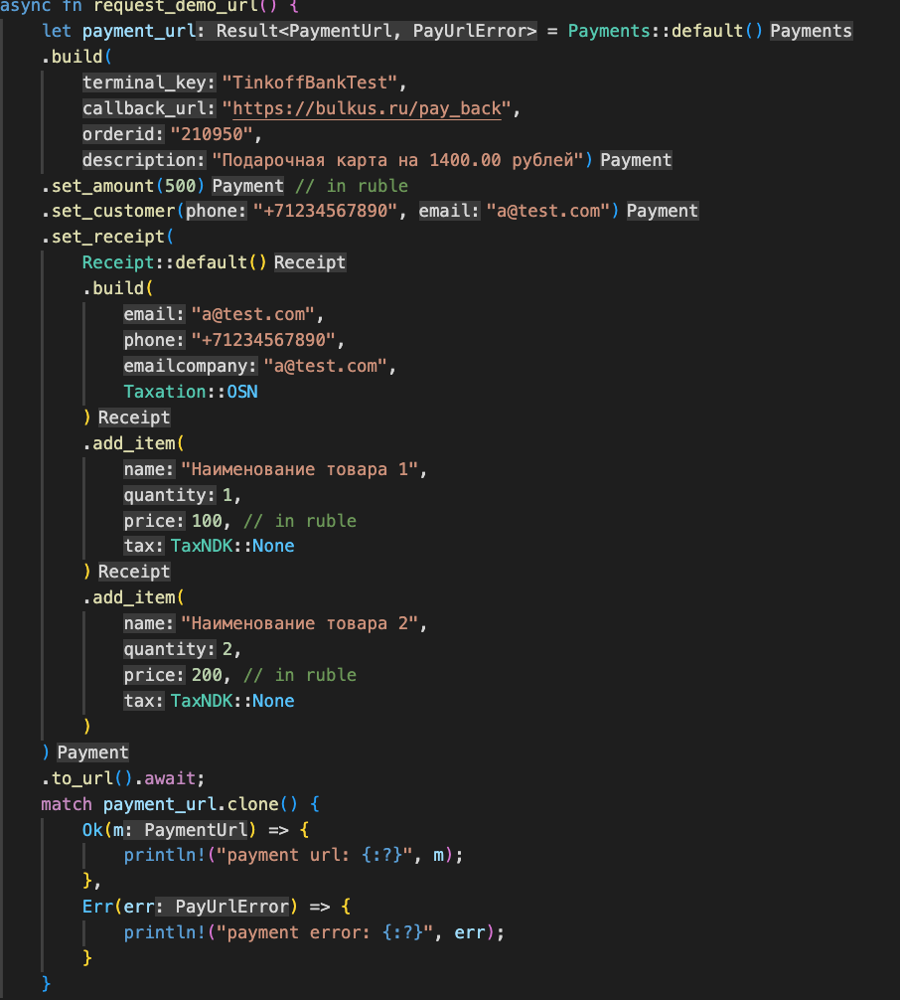

<h1 align="center">TinkoffPay-rs</h1>

<div style="display:flex;flex-direction:row;gap:5px; width:100%;justify-content:center;">
  

  

  

  

  <!--  -->

  <!--  -->

  <!--  -->
</div>

<!-- Status -->

<!-- <h4 align="center"> 
	🚧  TinkoffPay 🚀 Under construction...  🚧
</h4> 

<hr> -->

<p align="center">
  <a href="#dart-about">About</a> &#xa0; | &#xa0; 
  <a href="#sparkles-features">Features</a> &#xa0; | &#xa0;
  <a href="#rocket-technologies">Technologies</a> &#xa0; | &#xa0;
  <a href="#white_check_mark-requirements">Requirements</a> &#xa0; | &#xa0;
  <a href="#checkered_flag-starting">Starting</a> &#xa0; | &#xa0;
  <a href="#memo-license">License</a> &#xa0; | &#xa0;
  <a href="https://github.com/KM8Oz" target="_blank">Author</a>
</p>

<br>

## :dart: About ##

Simple tinkoff integration (the seller receives a link to the payment form and redirect the buyer to it); NB: with callback method

## :rocket: Technologies ##

The following tools were used in this project:

- [rust](https://www.rust-lang.org/)
- [crago](https://crates.io/)

## :white_check_mark: Requirements ##

Before starting :checkered_flag:, you need to have [Git](https://git-scm.com) and [Rust](https://www.rust-lang.org/) installed.

## :checkered_flag: Starting ##

```bash
# Clone this project
$ git clone https://github.com/KM8Oz/tinkoffpay-rs

# Access
$ cd tinkoffpay-rs

# Install dependencies
$ cargo install --path=.

# Run the project
$ cargo test request_demo_url -- --nocapture 

# The server will initialize in the <http://localhost:3000>
```

## :checkered_flag: Usage ##

```rust
// should be an async fn 
    let payment_url = Payments::default()
        .build(
            "TinkoffBankTest",
            "https://bulkus.ru/pay_back",
            "210950", 
            "Подарочная карта на 1400.00 рублей")
        .set_amount(500) // in ruble
        .set_customer("+71234567890", "a@test.com")
        .set_receipt(
            Receipt::default()
            .build(
                "a@test.com", 
                "+71234567890", 
                "a@test.com", 
                Taxation::OSN
            )
            .add_item(
                "Наименование товара 1", 
                1, 
                100, // in ruble
                TaxNDK::None
            )
            .add_item(
                "Наименование товара 2", 
                2, 
                200, // in ruble
                TaxNDK::None
            )
        )
        .to_url().await;
        match payment_url.clone() {
            Ok(m) => {
                println!("payment url: {:?}", m);
            },
            Err(err) => {
                println!("payment error: {:?}", err);
            }
        }
```

## :memo: License ##

This project is under license from MIT. For more details, see the [LICENSE](LICENSE.md) file.


Made with :heart: by <a href="https://github.com/KM8Oz" target="_blank">@KM8Oz</a>
&#xa0;
&#xa0;
<div align="center" id="top"> 
  

  &#xa0;

  <!-- <a href="https://tinkoffpay-rs.netlify.app">Demo</a> -->
</div>

&#xa0;
<a href="#top">Back to top</a>
